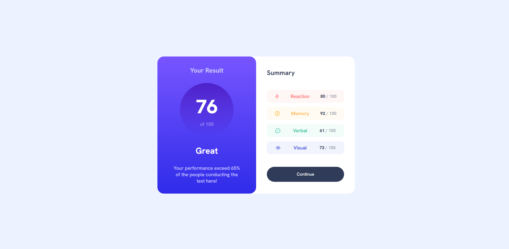

# Frontend Mentor - Results summary component solution

This is a solution to the [Results summary component challenge on Frontend Mentor](https://www.frontendmentor.io/challenges/results-summary-component-CE_K6s0maV). Frontend Mentor challenges help you improve your coding skills by building realistic projects.

## Table of contents

- [Overview](#overview)
  - [The challenge](#the-challenge)
  - [Screenshot](#screenshot)
  - [Links](#links)
- [My process](#my-process)
  - [Built with](#built-with)
  - [What I learned](#what-i-learned)
  - [Useful resources](#useful-resources)
- [Author](#author)

## Overview

### The challenge

Users should be able to:

- View the optimal layout for the interface depending on their device's screen size
- See hover and focus states for all interactive elements on the page

### Screenshot



### Links

- Solution URL: [Frontend Mentor Solution](https://www.frontendmentor.io/solutions/responsive-summary-component-using-tailwind-and-flexbox-BRc3pk_W06)
- Live Site URL: [Vercel](https://fm-summary.vercel.app/)

## My process

### Built with

- Flexbox
- Mobile-first workflow
- [React](https://reactjs.org/) - JS library
- [ViteJS](https://vitejs.dev/) - Development environment
- [Tailwind](https://tailwindcss.com/) - CSS Framework

### What I learned

### Tailwind gradients with custom themes

```html
<div className="bg-gradient-to-t from-gradient-1-from to-gradient-1-to"></div>
```

### Useful resources

- [Tailwind Docs](https://tailwindcss.com/docs) - Tailwind documentation is extremely helpful and rich in examples

## Author

- Frontend Mentor - [@DevMaktubi](https://www.frontendmentor.io/profile/DevMaktubi)
- LinkedIn - [Breno Luiz](https://www.linkedin.com/in/breno-luiz)
